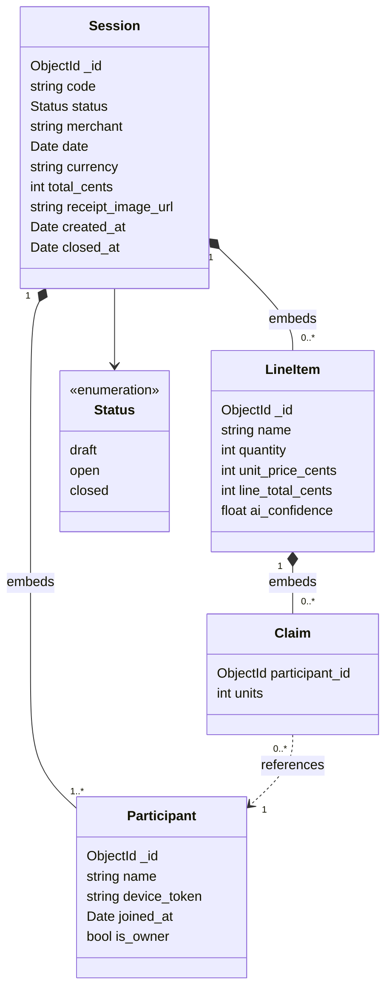
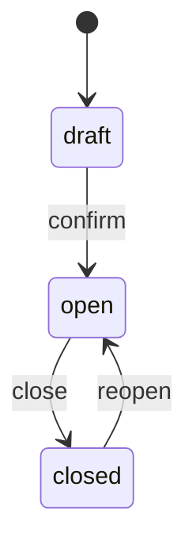
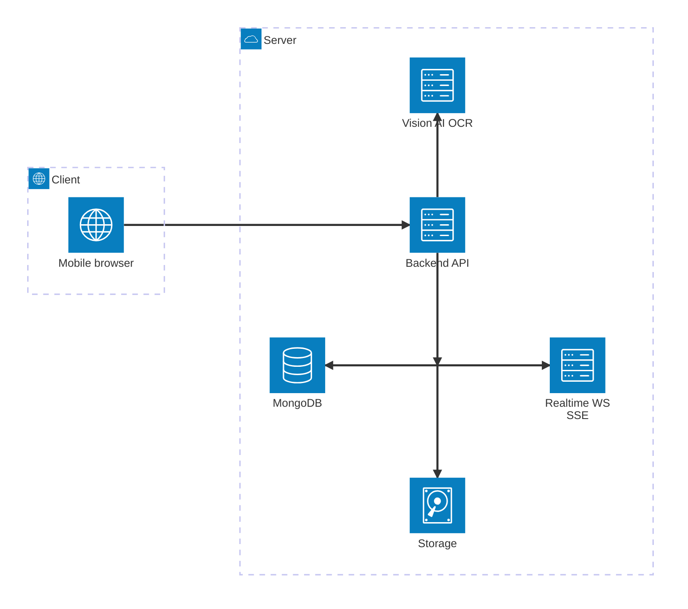

# SnapSplit — Design

Web app (mobile-first) to split a bar/restaurant bill from a photo of the receipt. One payer
fronts the bill; everyone else marks what they consumed and the system computes how much each
person owes.

---

## 1. Use Case Diagram

Diagram source: [`docs/dcu.puml`](docs/dcu.puml)

[](https://editor.plantuml.com/uml/bPJHJkim38RlynJMRWvSR0-0q8I4419NY1tExHHQirgaIHIx6qVYuKd6qePqGkAgbVF5_ktVxGsB3ZBqHWc9GTXOxJVUa2Xby5L070JQTG8j1Mo4d5LAD-82B1xrVmmBq0nUxtJhGZwu7v3bU41sJnAFb1eO6yq8Yx_w3I6cGl82ldFYZkJpxVRL2UemaK-u9pnaDbCXHhd4xbgI6i8OAvd7uSKGTy3875l8c4_XfWJ_fOeLjSUmZQ7K-baEBdoQnEMSt-gsf-BMhN7nKQLlC0Gzhx3fT40mPDz6qFK-UaMrt5qQDvVLyzXv8XySsRhoO2ambl8qzK22FK_JDWPjd93w0qU_uwIDJcl07NbM9-TXkLmN5bRHCibJUHrUK0w8zfGw2e6aXDMO2bQjEzZLkd0Uhk3wccnZXXRNQpMw3Ql1pq5y5xJj5vVj_WqvbQzjdUkO4SlbHtLLrOPFMixc7qLzpr_g6jVY9q5r8-E6L9UYGyUljx8vuzdHq-QCRr2tCDUIbm1MwRzobX-RlOcFz4lw10)
---

## 2. Roles

- **Payer (owner):** creates the session, uploads the photo, corrects the data, shares the
  link, controls the state and sees the summary. The only one with edit permissions on the
  receipt.
- **Guest (diner):** joins via link, identifies with a name (no sign-up), marks what they
  consumed.

There are no user accounts for guests: zero friction. The payer is also a `Participant` (the
only one with `is_owner = true`), so they can claim their own items like anyone else. Their
`device_token` grants them the receipt's edit permissions and lets them recover their
sessions; there is no separate login.

---

## 3. End-to-end flow

1. **Photo**: the payer opens the phone camera from the browser and snaps the receipt.
2. **AI extraction**: the image is sent to the backend and the AI returns structured JSON
   with merchant, date, line items (name, quantity, unit price, total) and the bill total. Each
   field's confidence is flagged.
3. **Review**: the payer sees the draft and can: edit text and prices, merge/split line
   items, delete, add by hand and confirm the total. Nothing is final until they confirm.
4. **Publish**: on confirmation a session and a short link (`<code>`) are created.
5. **Splitting**: guests open the link, type their name and mark their items
   (see [#6](#6-splitting-logic-the-core)). Everyone sees the state live.
6. **Close**: the payer closes the session; the split is frozen and each person sees their
   total.

---

## 4. Data model

**MongoDB**, one document per session in a `sessions` collection. Line items,
participants and claims are **embedded** in the session document: a single read loads the
whole state, writes are atomic at the document level, and one Change Stream per session
powers real time ([#7](#7-real-time)). The session is the natural aggregate — everything is scoped to it and
nothing is queried across sessions. Money fields are integer **cents**.

The logical relationships:



Concrete document shape:

```json
{
  "_id": "ObjectId",
  "code": "AB7K9",
  "status": "open",
  "merchant": "Bar Paco",
  "date": "2026-07-07",
  "currency": "EUR",
  "total": 4230,
  "receipt_image_url": "https://…",
  "created_at": "2026-07-07T20:11:00Z",
  "closed_at": null,

  "participants": [
    { "_id": "p1", "name": "Ana", "is_owner": true,
      "device_token": "<secret>", "joined_at": "…" },
    { "_id": "p2", "name": "Luis", "is_owner": false,
      "device_token": "<secret>", "joined_at": "…" }
  ],

  "line_items": [
    { "_id": "l1", "name": "Caña", "quantity": 3,
      "unit_price": 200, "line_total": 600, "ai_confidence": 0.94,
      "claims": [
        { "participant_id": "p2", "units": 2 },
        { "participant_id": "p1", "units": 1 }
      ]
    }
  ]
}
```

Claims live inside their line item and point to a participant by `participant_id` (a sibling
in the same document). Indexes: unique on `code`; `participants.device_token` for auth
([#10](#10-considerations)).

---

## 5. Session states



- **draft:** payer only. Editable receipt, no active public link.
- **open:** active link, guests marking, split recomputing live.
- **closed:** everything frozen, final totals shown. Reopenable by the payer.

---

## 6. Splitting logic (the core)

Each receipt line is split by units and the guest claims the ones they consumed.

### By units — for individual items

E.g.: line "3 Beers -- 2.00 €/unit". Each person claims the units they had.
`price_per_unit = line_total / quantity`. Guest cost = `units * price_per_unit`.
The UI shows remaining units (`quantity - sum(units)`) so nothing is left over or short.

### Total per person

```
total_i = subtotal_consumed_i
```

### Rounding

Everything is computed in cents. After rounding, the sum of parts may differ from the total
by ±1–2 cents. The discrepancy is **always adjusted on the payer's share** so that
$\sum_i \text{total}_i = \text{total}$ exactly. It is a deterministic rule (the payer is a single,
fixed participant), so every device reaches the same result from the same state. Guests are
never asked for more than the lines add up to.

### Unassigned

Units/lines that nobody claims stay "unassigned" and are shown highlighted.
**Each item is marked by its own consumer**: neither the payer nor anyone else can assign
items to another participant, and they are never split automatically into equal shares. If
something is left pending, the group talks it over and whoever is missing marks theirs. The
session cannot be closed while there are unassigned units.

---

## 7. Real time

- On opening the link, each device subscribes to the session's changes.
- Events that propagate: new guest, claim created/edited, line edited by the payer, state
  change.
- The **split is computed on the client** from the synced state (lines + claims), so
  recomputation is instant; the server is the source of truth for the data.
- The payer sees a live panel: list of people, what each has marked, how much each has so far
  and how much is still unassigned.
- **Mechanism:** the server opens a **MongoDB Change Stream** on the session document and
  pushes each change to the subscribed devices over WebSocket/SSE (clients never connect to
  the database directly). Because writes are atomic on that single document, the change
  stream emits a consistent post-write state.

---

## 8. Screens

**Payer**

1. Home → "Take a photo of the receipt".
2. Camera / upload image → analysis spinner.
3. Receipt review (editable lines, low-confidence warnings, total).
4. Live session: link + QR to share, people & progress panel, "Close" button.
5. Final summary: how much each person owes, balanced total, payment details.

**Guest**

1. Link landing → types their name.
2. Item list: marks the units they had. Sees their total updating.
3. Confirmation: "You owe X € to <payer>".

---

## 9. Technical architecture (agnostic)



---

## 10. Considerations

- **Privacy:** session access only by code; guests can only edit their own.
- **Anti-cheating:** a guest cannot modify lines or other people's items, the payer has the
  final say when closing. This is **validated on the server**: each action (create/edit a
  `Claim`, edit lines, close) is authorized against the accompanying `device_token`, never
  trusting what the client declares. The `device_token`s and the session `code` must be long,
  unguessable secrets (with rate-limiting on `code`).
- **AI robustness:** extracted prices can be wrong → the review screen is mandatory and
  highlights doubtful items; it validates that `Σ lines ≈ total` of the receipt.
- **Edge cases:** decimals/rounding, discounts, negative lines, illegible receipt (allow
  100% manual entry), guest who leaves without marking.

---

## 11. Future features (out of MVP)

- **Sharing products:** split a single line among several people (wine, paella, bread)
  equally or by weight. Would require reintroducing shared splitting in
  [#6](#6-splitting-logic-the-core) and a `share_weight` on `Claim`.
- Payer login and history, payment integration (Bizum/Stripe/Solana), export summary.
